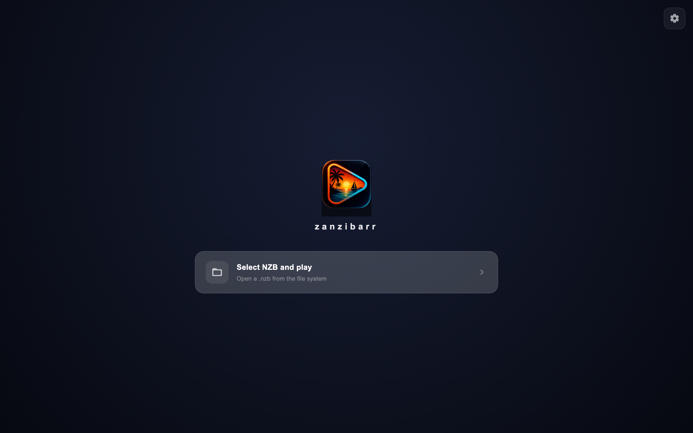
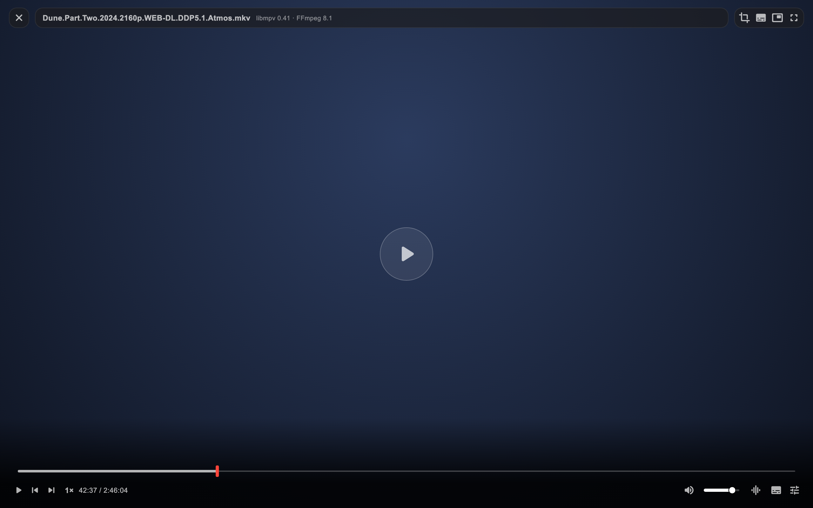
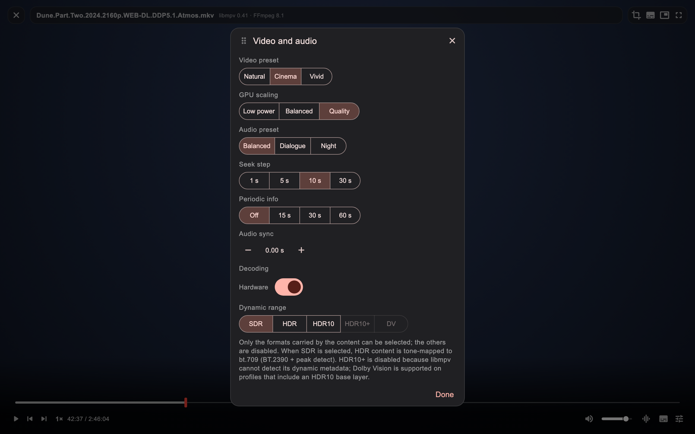
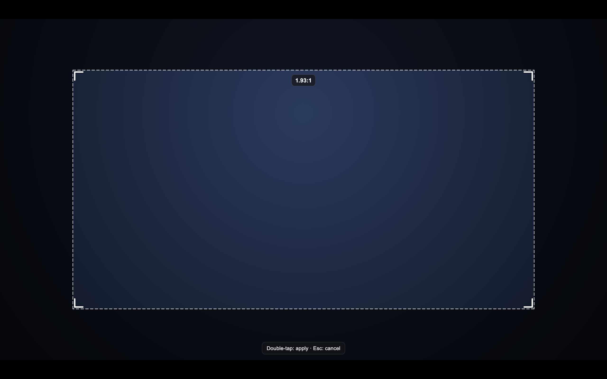
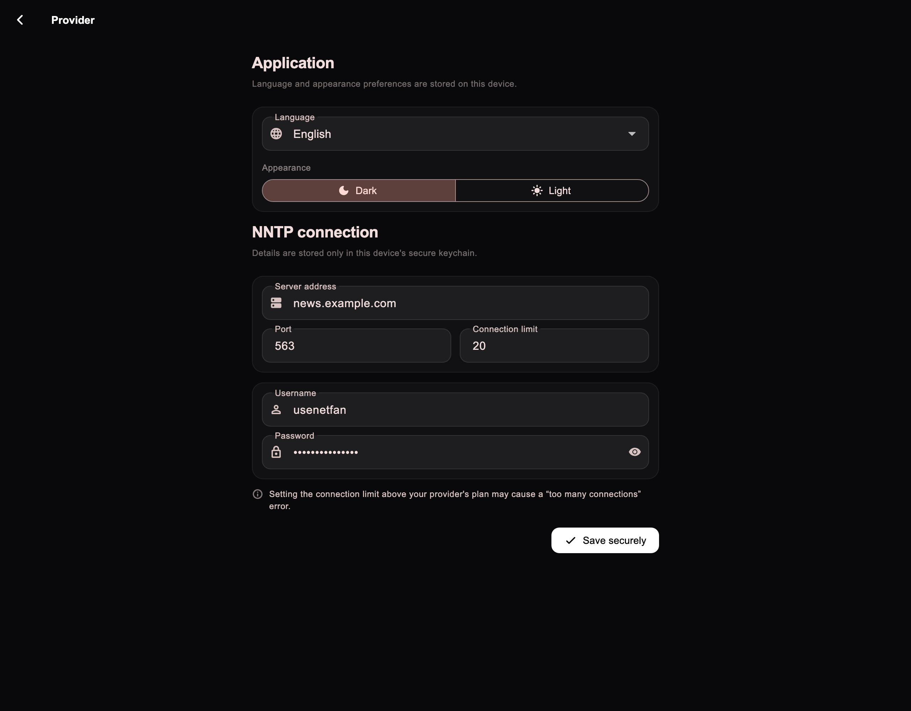
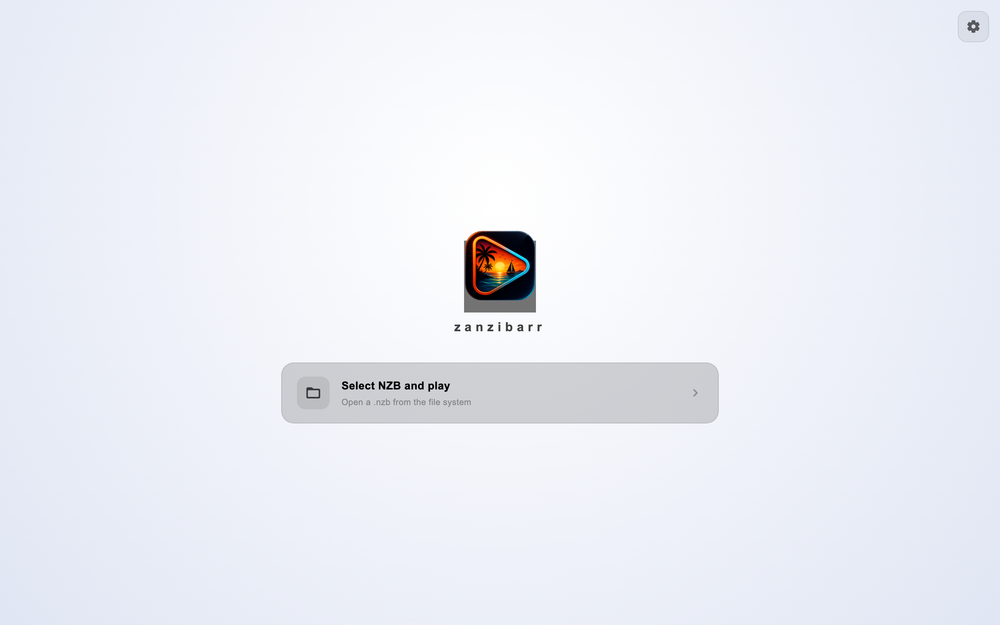

<p align="center">
  
</p>

<h1 align="center">zanzibarr</h1>

<p align="center">
  <strong>Stream anything from Usenet. Own nothing. Wait for nothing.</strong>
</p>

<p align="center">
  <a href="https://github.com/envermeister/zanzibarr/actions/workflows/windows-build.yml"></a>
  <a href="https://github.com/envermeister/zanzibarr/actions/workflows/android-build.yml"></a>
  
  
  <a href="https://www.patreon.com/cw/envermeister"></a>
</p>

---

zanzibarr turns Usenet into your personal streaming library. Point it at any `.nzb` and the video starts playing in seconds — **no download queue, no waiting for the full file, no disk space sacrificed**. Scrub to the final scene of a 4K remux before the first act would have finished downloading. It feels like magic; it's really just a very disciplined engine.

## Screenshots

<p align="center">
  
</p>

<p align="center">
  
</p>

<p align="center">
  
</p>

<details>
  <summary>More screenshots</summary>
  <p align="center"></p>
  <p align="center"></p>
  <p align="center"></p>
  <p align="center"></p>
</details>

## Why zanzibarr is different

**Play instantly, never download**
The Rust engine maps every seek position to the exact Usenet segments that hold it, fetches only those, decodes yEnc on the fly and serves the result through a lazy, range-aware local stream. Pause the player and the network goes quiet. Close the app and nothing is left behind on your disk.

**Seek like it's a local file**
Byte offsets are resolved from the decoded yEnc `begin/end` positions of every segment — never guessed from article sizes. The result is frame-accurate seeking across thousands of segments, even mid-segment, even on 100+ GB releases.

**It opens the archives others won't**
Straight video NZBs, multi-volume **RAR5** sets and split **7z** releases — including **AES-256 encrypted 7z** archives — are reassembled into a single virtual, seekable file entirely in memory. Nothing is extracted to disk. (Deliberately honest: compressed RAR/7z and RAR4 are declined rather than faked — see the roadmap.)

**A picture pipeline that respects your content**
- Dynamic range selector that adapts to the file: **SDR · HDR · HDR10 · Dolby Vision** — modes the content doesn't carry stay visibly disabled, so you always know exactly what you're watching.
- Dolby Vision handled honestly: **Profile 5** is reshaped on the GPU via libplacebo (Vulkan → Metal), HDR10-based profiles ride the natural decoder path — no pink-and-green fakeouts.
- BT.2390 tone mapping with per-frame peak detection for clean SDR conversion.
- Custom libmpv 0.41 + full FFmpeg 8.1 build: **TrueHD / Atmos, DTS-HD MA**, AV1 and everything else your releases actually use.
- Video presets (Natural / Cinema / Vivid), GPU scaling quality, and audio presets (Balanced / Dialogue / Night) — one tap, no filter graphs.
- Hardware or software decoding, your call.

**Smart Canvas**
Letterboxed rip? Draw your own crop with draggable handles, preview the aspect ratio live, and apply it on the GPU surface without touching hardware decode.

**A player that gets out of the way**
Auto-hiding controls, double-click to seek ±10 s, click-to-pause, frame stepping, speed control, audio sync nudge, volume slider, Picture-in-Picture, and external audio/subtitle loading alongside the embedded tracks.

**Speaks your language**
14 fully localized interfaces: English, Türkçe, Español, Deutsch, Français, Português, Italiano, Русский, 中文, 日本語, 한국어, हिन्दी, العربية and فارسی — with proper RTL layout. Dark and light themes, of course.

**Built for the couch and the desk**
Native apps for **macOS**, **Windows**, **Android** and **Android TV** (leanback launcher, remote-friendly focus, hardware decode). One codebase, no Electron, no compromises.

**Your credentials stay yours**
Your Usenet login lives exclusively in the operating system's secure keychain — never in files, never in logs, never on a server. zanzibarr is fully on-device: no accounts, no telemetry, no cloud.

## How it works

```
 .nzb ──▶ NZB parser ──▶ segment map (yEnc begin/end)
                              │
                 NNTP pool (TLS, pipelined)
                              │
              fetch → yEnc decode → CRC32 verify
                              │
        archive layer (RAR5 / 7z STORE·AES → virtual file)
                              │
              localhost HTTP server (Range requests)
                              │
                     libmpv / media_kit
```

Everything heavy — parsing, decoding, archive surgery, NNTP networking — is Rust (`flutter_rust_bridge` under the hood). Everything you touch is Flutter. The engine only ever downloads the slices you actually watch.

## Getting started

1. Grab the latest build for your platform from [Releases](https://github.com/envermeister/zanzibarr/releases) (Windows `.exe`, Android `.apk` — pick `arm64-v8a` for phones and TV boxes).
2. Open the settings gear and add your Usenet provider's NNTP host, port, username and password. They're stored in the OS keychain.
3. Drop in any `.nzb` from your favorite indexer and press play.

You need your own Usenet provider account and NZB sources — zanzibarr is the player, not the library.

## Building from source

Requirements: Flutter (stable), Rust toolchain, and for macOS the Xcode command line tools.

```bash
git clone https://github.com/envermeister/zanzibarr.git
cd zanzibarr
flutter pub get
flutter gen-l10n
flutter run            # macOS / Windows / Linux desktop
flutter run -d android # Android device / TV box
```

Run the test suites:

```bash
flutter test           # Flutter side
cargo test             # inside rust/ — engine side
```

CI produces the Windows `.exe` and Android `.apk` artifacts on demand (see `.github/workflows/`).

## Roadmap

- [x] Streaming playback with true seek (STORE releases)
- [x] Multi-volume RAR5 & split 7z (STORE, AES-256) as virtual files
- [x] HDR / HDR10 / Dolby Vision mode selection & tone mapping
- [x] Android TV, 14 languages, dark & light themes
- [ ] Newznab indexer search (browse & play without leaving the app)
- [ ] Compressed RAR/7z stream-seek, in-stream AES for RAR
- [ ] PAR2 health check & repair
- [ ] iOS & Linux builds

## Support the project

zanzibarr is free and open source, built in spare time. If it saved you a download queue, you can buy the next coffee that funds the engine on [Patreon](https://www.patreon.com/cw/envermeister). One-off or monthly — both keep the commits coming.

## A note on responsibility

zanzibarr is a neutral playback engine. You are responsible for the content you access and for complying with the laws of your jurisdiction and the terms of your Usenet provider.
